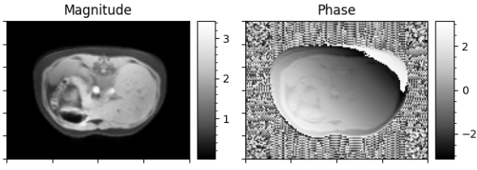
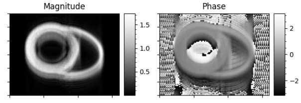

<p align="center">
  
</p>

**FEelMRI** is an open-source and multi-platform library for generating synthetic magnetic resonance images from finite-element (FE) simulations. The library is designed to handle complex phenomena whose behavior is described by partial differential equations and approximated using FEM. **FEelMRI** supports FE meshes with arbitrary cell geometries and simulations performed in any discrete function space.

<table align="center">
  <tr>
    <td align="center">
      <br>
      <b>Orthogonal-CSPAMM MRI</b>
    </td>
    <td align="center">
      <br>
      <b>4D flow MRI</b>
    </td>
  </tr>
  <tr>
    <td align="center">
      <br>
      <b>Abdomen FFE</b>
    </td>
    <td align="center">
      <br>
      <b>Free Running MRI</b>
    </td>
  </tr>
</table>

## Table of Contents
- [Installation instructions](#installation-instructions)
- [First run](#first-run)
- [How to contribute](#how-to-contribute)
- [How to cite](#how-to-cite)
- [License](#license)

## Installation instructions
The following instructions allows you to install ```FEelMRI``` on your local machine and have been tested mainly on Linux systems. For Windows and MacOS users, we refer to the section [Docker images for multi-platform compatibility](#docker-images-for-multi-platform-compatibility).

### Installing dependencies
Most of the required dependencies can be installed via ```pip``` or are already included in your system. However, some dependencies may require additional system packages. Below are the instructions for installing the necessary dependencies on Ubuntu/Debian-based systems.

Dependencies such as ```build-essential```, ```python3-dev```, ```python3-pip```, ```python3-tk```, ```python3-setuptools```, ```libopenmpi-dev```, and ```cmake``` can be installed via the ```install_dependencies.sh``` script as follows:
```bash
source install_dependencies.sh
```
or
```bash
chmod a+x install_dependencies.sh && ./install_dependencies.sh
```

All the required Python dependencies are listed in the ```requirements.txt``` file. These can be installed via pip:
```bash
pip3 install -r requirements.txt --user
```

### Cloning the repository
To install the library, first clone the repository and navigate to the ```feelmri/``` folder:
```bash
git clone https://github.com/hernanmella/feelmri && cd feelmri/
```
After cloning, the first step should be to unzip the finite-element phantoms used in the examples:
```bash
7z x examples/phantoms/phantoms_compressed.zip -o examples/phantoms/
```

### Installing FEelMRI
To install the library, within the cloned directory run:
```bash
pip3 install . --user
```


### Docker images for multi-platform compatibility
To ensure compatibility across different systems and avoid dependency issues, all the previous steps can be encapsulated in a Docker container. You can use Docker to install and run FEelMRI in a containerized environment. The platform-specific instructions to install Docker can be found on the [official Docker website](https://docs.docker.com/get-docker/).

To build a Docker image, the ```Dockerfile``` provided in the ```docker/``` folder can be build as follows:
```bash
docker build --build-arg UID=$(id -u) --build-arg GID=$(id -g) . -f docker/Dockerfile -t image_name
```
Here, ```foo``` can be either ```cpu``` or ```gpu```, and ```image_name``` will be the tag for your image. The ```--build-arg UID=$(id -u)``` and ```--build-arg GID=$(id -g)``` arguments ensure that files created inside the container are owned by your user, avoiding permission issues.

#### Starting a FEelMRI Docker Container
To start a Docker container with FEelMRI, use the following command based on your needs:
```bash
docker run --name container_name --shm-size 256m -ti -v $(pwd):/home/FEelMRI/ image_name
```
Here, replace ```container_name``` with your desired container name and ```image_name``` with the tag of the image you built earlier. The ```--shm-size 256m``` option increases the shared memory size, which can be beneficial for certain applications.

#### Allowing plots inside containers
To enable plotting within Docker containers, run (in place of the above `docker run` commands):
```bash
docker run -it \
    --name container_name \
    --user=$(id -u $USER):$(id -g $USER) \
    --env="DISPLAY" \
    --volume="/etc/group:/etc/group:ro" \
    --volume="/etc/passwd:/etc/passwd:ro" \
    --volume="/etc/shadow:/etc/shadow:ro" \
    --volume="/etc/sudoers.d:/etc/sudoers.d:ro" \
    --volume="/tmp/.X11-unix:/tmp/.X11-unix:rw" \
    -v $(pwd):/home/feelmri/ image_name
```

## First run
Once the installation is complete, you can run the example scripts provided in the ```examples/``` folder. These scripts demonstrate how to use the FEelMRI library to generate synthetic MRI images from finite-element simulations contained in the ```examples/phantoms/``` folder. To run an example, navigate to the ```examples/``` directory and execute one of the scripts. For instance:
```bash
cd examples/
mpirun -n nb_cores python3 foo.py
```
Replace ```nb_cores``` with the number of CPU cores you want to use and ```foo.py``` with the name of the example script you wish to run.

## How to contribute
We welcome contributions from the community! More information on how to contribute can be found in the [CONTRIBUTING.md](CONTRIBUTING.md) file.

## How to cite
Article under review. Citation details will be provided soon.

## License
This project is licensed under the MIT License - see the [LICENSE](LICENSE) file for details