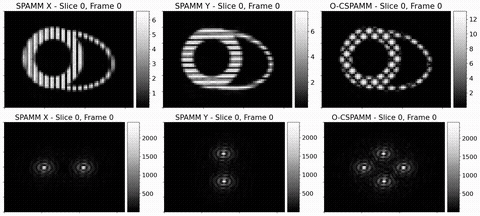

<!-- <p align="center"> -->
  
<!-- </p> -->

**FEelMRI** is an open-source library for generating synthetic magnetic resonance images from finite-element (FE) simulations. The library is designed to handle complex phenomena whose behavior is described by partial differential equations and approximated using FEM. **FEelMRI** supports FE meshes with arbitrary cell geometries and simulations performed in any discrete function space.

<p align="center">
   
</p>

## Installation instructions
To install the library, first clone the repository and navigate to the ```feelmri/``` folder:
```bash
git clone https://github.com/hernanmella/feelmri && cd feelmri/
```

### Dependencies
Most of the required dependencies can be installed via pip. However, some dependencies may require additional system packages. Below are the instructions for installing the necessary dependencies on Ubuntu/Debian-based systems.


Dependencies such as ```build-essential```, ```python3-dev```, ```python3-pip```, ```python3-tk```, ```python3-setuptools```, ```libopenmpi-dev```, ```mpich```, and ```cmake``` can be installed via the ```install_dependencies.sh``` script as follows:
```bash
source install_dependencies.sh
```
or
```bash
chmod a+x install_dependencies.sh && ./install_dependencies.sh
```

All the required Python dependencies are listed in the ```requirements.txt``` file. These can be installed via pip:
```bash
pip3 install -r requirements.txt --user
```

### FEelMRI library installation
To install the library, within the ```feelmri/``` directory run:
```bash
pip3 install . --user
```


### Docker images for multi-platform compatibility
To ensure compatibility across different systems and avoid dependency issues, you can use Docker to install and run FEelMRI in a containerized environment.

A Dockerfile is provided in the ```docker/``` folder. To build a Docker image, use the following command:
```bash
docker build --build-arg UID=$(id -u) --build-arg GID=$(id -g) . -f docker/Dockerfile -t image_name
```
Here, ```foo``` can be either ```cpu``` or ```gpu```, and ```image_name``` will be the tag for your image. The ```--build-arg UID=$(id -u)``` and ```--build-arg GID=$(id -g)``` arguments ensure that files created inside the container are owned by your user, avoiding permission issues.

#### Starting a FEelMRI Docker Container
To start a Docker container with FEelMRI, use the following command based on your needs:
```bash
docker run --name container_name --shm-size 256m -ti -v $(pwd):/home/FEelMRI/ image_name
```
Here, replace ```container_name``` with your desired container name and ```image_name``` with the tag of the image you built earlier. The ```--shm-size 256m``` option increases the shared memory size, which can be beneficial for certain applications.

#### Allowing plots inside containers
To enable plotting within Docker containers, run (in place of the above `docker run` commands):
```bash
docker run -it \
    --name container_name \
    --user=$(id -u $USER):$(id -g $USER) \
    --env="DISPLAY" \
    --volume="/etc/group:/etc/group:ro" \
    --volume="/etc/passwd:/etc/passwd:ro" \
    --volume="/etc/shadow:/etc/shadow:ro" \
    --volume="/etc/sudoers.d:/etc/sudoers.d:ro" \
    --volume="/tmp/.X11-unix:/tmp/.X11-unix:rw" \
    -v $(pwd):/home/feelmri/ image_name
```