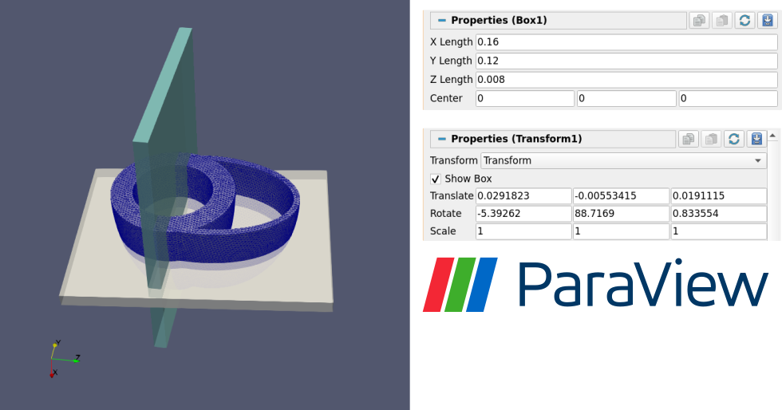

# Exam Planning with ParaView

**FEelMRI** uses [**ParaView**](https://www.paraview.org/) state files (`.pvsm`) to plan MRI acquisitions based on the **phantom geometry** and **region of interest (ROI)**.
These state files define the visualization and acquisition setup used to generate synthetic MRI data.

For the provided examples, the planning files are located in:

```
examples/planning/
```

---

## 📁 Example ParaView State Files

This folder includes a set of ready-to-use `.pvsm` files for common MRI acquisition types:

| State File            | Description                                                      |
| --------------------- | ---------------------------------------------------------------- |
| `4dflow.pvsm`         | Planning 4D Flow MRI acquisitions (velocity mapping).            |
| `abdomen.pvsm`        | Planning abdominal MRI acquisitions.                             |
| `beating_heart.pvsm`  | Planning cardiac MRI acquisitions using a beating heart phantom. |
| `phase_contrast.pvsm` | Planning phase-contrast MRI acquisitions.                        |
| `water_fat.pvsm`      | Planning water–fat separation phantom MRI acquisitions.          |

When loaded in ParaView, each state file automatically visualizes the corresponding phantom geometry and the associated MRI acquisition setup.

---

## 🖥️ Visualizing State Files in ParaView

1. **Open ParaView.**
2. Select **File → Load State...** and choose one of the provided `.pvsm` files (e.g., `4dflow.pvsm`).
3. If ParaView cannot find the linked data files, right-click the missing entries in the **Pipeline Browser** and choose **Change File...** to update the path to the corresponding phantom file (e.g., `examples/phantoms/4dflow.xdmf`).

> 💡 Tip: Once corrected, you can save the updated `.pvsm` file to preserve your local paths.

---

## 🧩 Planning MRI Acquisitions

To design a new MRI acquisition or modify an existing one:

1. **Load the Phantom Geometry**
   Open the desired phantom or simulation file (e.g., `4dflow.xdmf`) from `examples/phantoms/`.

2. **Define the Field of View (FOV)**
   Add a **Box** source (`Sources → Box`) and set its dimensions to represent the desired FOV.

3. **Adjust Orientation and Position**
   Apply a **Transform** filter to the Box to move and rotate it into the correct imaging position and orientation.

4. (Optional) Add **slicing planes** or **annotations** to inspect the intersection between the FOV and the underlying geometry.

Once the FOV is properly aligned, save the updated scene as a new ParaView state file for later use.

### Example
<p align="center">  </p>

Example of a cardiac MRI planning setup in ParaView, showing the original Box defining the FOV (light blue box) and the transformed Box aligned with the heart phantom (gray box).

---

## 🧠 Using Planned Acquisitions in FEelMRI

After defining your acquisition setup in ParaView, you can import the resulting parameters directly into FEelMRI using the **`PVSMParser`** utility.
This allows your MRI simulations to reproduce the same geometry and imaging configuration defined in ParaView.

Example:

```python
from feelmri import PVSMParser

parser = PVSMParser("examples/planning/4dflow.pvsm")
print(parser.FOV) # field of View dimensions
print(parser.LOC) # translation vector
print(parser.MPS) # orientation matrix
```